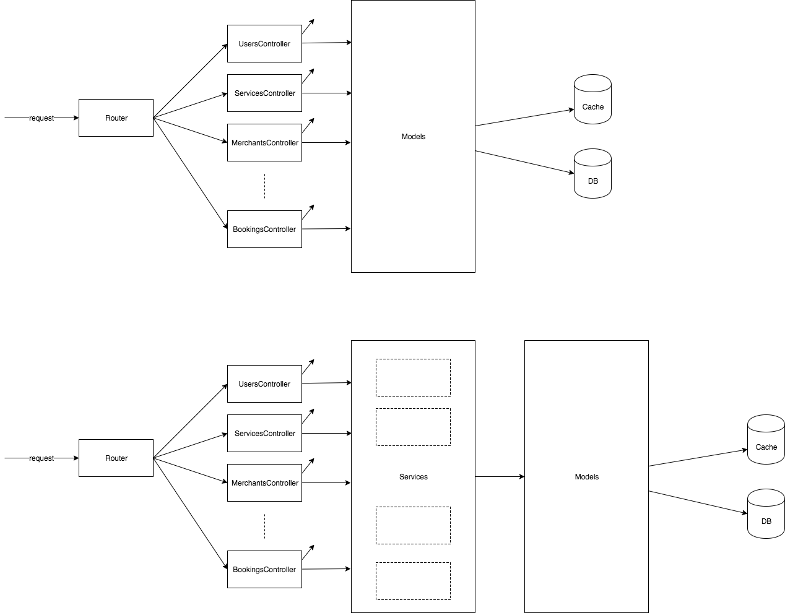

   
# ITB
27 October 2017
# Fast track to world class engineering

## Topics
### Launchpad for impact
Things you need to know to have significant impact

The idea here is that, to have impact, you need to be able to build things that can grow. Your codebase has to be extensible and flexible enough, within reason of course.

If that is not the case, you will keep running into 2 things:

1) scaling issues with even small amounts of growth
2) inability to accomodate feature requests, even simple ones

I propose a list of skills that I feel are necessary

1) CS Foundation
2) Object oriented basics, concepts and principles
3) Basic software architecture
4) Basic system architecture
5) Tests

### CS Foundation

As a product engineer, knowing how things work is beneficial. Specifically the things we depend on. Knowing the performance and limits of your machines, being aware of the myths of [distributed computing](https://en.wikipedia.org/wiki/Fallacies_of_distributed_computing) and the uses of different database systems will give you additional contexts when designing systems and writing code.

Storage - mem, disk
CPU - processes, threads
Network - roundtrip, latencies, discovery, protocols, routing
Databases - ACID, transactions, indexes,

### Object oriented design

This is probably still the most accessible and scalable paradigm for application design with many well thought out concepts to give engineers a good set of tools to design significant applications.

These basics are non-negotiable. Learn fundamentals then frameworks.

1) OO Basics: class, object
2) OO Concepts: abstraction, encapsulation, polymorphism, inheritance [Read](https://en.wikipedia.org/wiki/Object-oriented_programming)
3) OO Principles: [SOLID](https://en.wikipedia.org/wiki/SOLID_(object-oriented_design)), [DRY](https://en.wikipedia.org/wiki/Don%27t_repeat_yourself), [READ](https://en.wikipedia.org/wiki/Object-oriented_programming#SOLID_and_GRASP_guidelines)
4) OO Patterns: [Read](http://www.blackwasp.co.uk/gofpatterns.aspx)

### Basic software architecture

Here we discuss the basic software architecture of an app and the importance of learning fundamentals first before frameworks. And the benefits of some simple indirection.

### Basic system architecture

Here we discuss a simple architecture. We initially discuss the "classic" one engineer architecture of dumping all componeents into 1 VM; the simplicity and limitations. Then we breakout into separate servers and discuss which bottlenecks arise first and subsequently as we address them.

### Tests

You made a change on Friday evening. Will you deploy?

### Important habits
1) Be curious
2) Prefer fundamentals over ____
3) Study every day with context

#### Be curious
How do things work?
Click a button on the browser…. 
How does Javascript work on the browser?

[Excellent talk](https://www.youtube.com/watch?v=8aGhZQkoFbQ&t=8s)

#### Prefer fundamentals over _____
Frameworks
How should you learn Rails?
Poor Poro
Too much magic

#### Study every day with context
TODO

#### Recap
Build up your skillset for IMPACT
Where can you build things?

1) Your Startup
2) Seed stage startups
3) Series A-B stage startups
4) Mature startups

Rank them by
1) Learning potential (broad vs deep)
2) Expertise (scale of problem solving)
3) Collaboration (w top talent)
4) Mentorship

